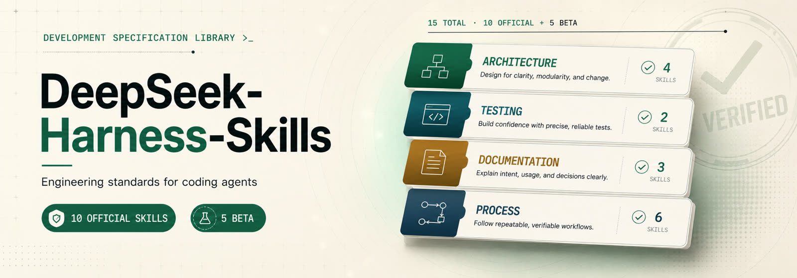

<p align="center">
  
</p>

<div align="center">

# DeepSeek-Harness-Skills

</div>

<div align="center">

A set of coding-agent skills distilled from the engineering conventions of **DeepSeek Harness** — executable standards your coding agent applies while coding, reviewing, testing, or documenting.

</div>

<p align="center">
  <b>English</b> · <a href="./README.zh-CN.md">简体中文</a>
</p>

## Get started

Install the set with the skills.sh installer, then pick the skills and agents you want:

```bash
npx skills@latest add arch3rPro/dsh-skills
```

Or just read one — each `SKILL.md` is a self-contained executable standard. Pick the discipline that matches what you're doing: [code-conventions](docs/architecture/code-conventions.md), [testing-tiers](docs/testing/testing-tiers.md), [prose-standard](docs/documentation/prose-standard.md), or any in [the set](#the-set).

## The set

Ten skills across four categories. Every one is **model-invoked** — the agent reaches for it automatically when a trigger fires.

| Skill | Category | What it does |
| --- | --- | --- |
| [defensive-patterns](docs/architecture/defensive-patterns.md) | architecture | bug-class rules for lifecycle, concurrency, teardown, untrusted I/O |
| [code-conventions](docs/architecture/code-conventions.md) | architecture | reversible side effects, explicit-over-implicit, config-over-hardcoding, branded ids |
| [extension-points-and-seams](docs/architecture/extension-points-and-seams.md) | architecture | build a seam only when a capability has multiple implementations or consumers |
| [testing-tiers](docs/testing/testing-tiers.md) | testing | pick the right tier, test the real entry path, verify the world not the self-report |
| [prose-standard](docs/documentation/prose-standard.md) | documentation | contract-first prose: preserve propositions, drop reasoning transcripts |
| [documentation-placement](docs/documentation/documentation-placement.md) | documentation | one home per fact; tutorials vs references; budgets as guardrails |
| [decision-records](docs/process/decision-records.md) | process | ADRs with classification, lifecycle, mandatory alternatives |
| [minimal-evidence-checks](docs/process/minimal-evidence-checks.md) | process | the smallest check set that covers the diff; fix or explain failures |
| [code-review](docs/process/code-review.md) | process | two axes (standards + spec); substantiated blockers over nits |
| [pr-history-hygiene](docs/process/pr-history-hygiene.md) | process | lease-protected rewrites, deliberate labels, native stack merges |

## Beta (in development)

Five further disciplines are grounded in DeepSeek Harness and under development. They are `npx skills`-installable but not yet part of the official plugin bundle.

| Skill | Category | What it does |
| --- | --- | --- |
| [postmortem](docs/process/postmortem.md) | process | backward-looking failure record: executive summary, root cause, guardrails |
| [runtime-invariants](docs/testing/runtime-invariants.md) | testing | assert only authoritative state, never service/method presence; fail loud |
| [responding-to-review-on-a-stack](docs/process/responding-to-review-on-a-stack.md) | process | fix on the introducing PR, propagate up-stack, re-audit after rewrites |
| [event-contract-matrix](docs/documentation/event-contract-matrix.md) | documentation | who produces and who listens to each event, bypass sites included |
| [module-layering](docs/architecture/module-layering.md) | architecture | derive and enforce the module dependency graph |

## Where they come from

Every skill is distilled from a real convention in DeepSeek Harness and adapted so it works in any codebase — not only inside the harness it came from.

## How it's packaged

Each skill is one `<category>/<name>` directory carrying three files in a single change:

- `SKILL.md` — the executable standard (Claude Code / any agent harness)
- `agents/openai.yaml` — Codex metadata and invocation policy
- `docs/<category>/<name>.md` — a human-facing docs page

```text
skills/
  architecture/   how code is shaped and how failure is handled
  testing/        how behavior is verified
  documentation/  how prose and docs are written
  process/        the workflow around code — decisions, review, checks, git
```

## Invocation design

Skills are either **model-invoked** (the agent reaches for them automatically when a trigger fires) or **user-invoked** (only a human typing the skill's name can fire them — zero context load, but the human is the index). All ten skills here are model-invoked.

## Installation

The two routes below are alternatives, not add-ons — pick one.

### `npx skills` — any agent (Claude Code, Codex, …)

Install one skill at a time (or the whole set from [Get started](#get-started)):

```bash
npx skills@latest add arch3rPro/dsh-skills --skill=code-review
```

> `npx skills` pulls from GitHub — publish the repo first, then run the command above.

### Claude Code — the plugin

Add this repo as a Claude Code marketplace, then install the plugin:

```bash
claude plugins marketplace add arch3rPro/dsh-skills
claude plugins install dsh-skills@dsh-skills
```

The plugin manifest lives in `.claude-plugin/` (`marketplace.json` + `plugin.json`).

## Acknowledgments

- **[DeepSeek Harness](https://github.com/deepseek-ai/deepseek-harness)** — an open-source agent harness developed by DeepSeek AI.
- **[mattpocock/skills](https://github.com/mattpocock/skills)** — Matt Pocock's agent skills for real engineering.
