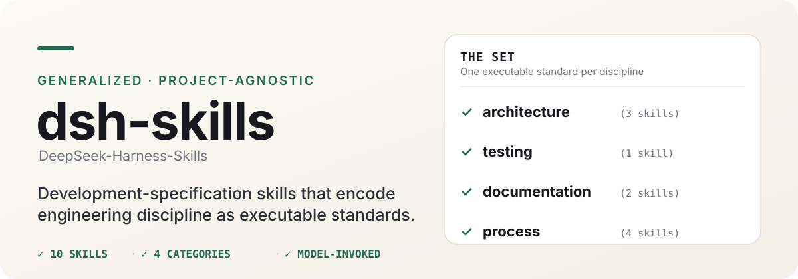

<div align="center">

# DeepSeek-Harness-Skills

</div>

<p align="center">
  一套精选的**通用、跨项目开发规范技能（development-specification skills）**——即你的编码智能体在编码、评审、测试或撰写文档时自动应用的“可执行标准”，而不是某个项目专属的配方。这些规范源自 **DeepSeek Harness** 的工程约定，并适配为可移植、跨项目通用的标准，适用于任意仓库。
</p>

<p align="center">
  <a href="./README.md">English</a> · <b>简体中文</b>
</p>

<p align="center">
  
</p>

## 快速开始

最快的使用方式是把这些标准安装给智能体，让它自动按需启用：

```bash
scripts/link-skills.sh   # 将每个技能软链接到 ~/.claude/skills 与 ~/.agents/skills
```

或者直接读其中一个——每份 `SKILL.md` 都是一份自包含的可执行标准。按你正在做的事挑选对应的规范：[code-conventions](docs/architecture/code-conventions.md)、[testing-tiers](docs/testing/testing-tiers.md)、[prose-standard](docs/documentation/prose-standard.md)，或[技能全集](#技能全集)中的任意一个。

## 技能全集

共十个技能，覆盖四大类。全部为**模型触发（model-invoked）**——当触发器命中时，智能体会自动启用它们。

| 技能 | 类别 | 作用 |
| --- | --- | --- |
| [defensive-patterns](docs/architecture/defensive-patterns.md) | 架构 | 面向生命周期、并发、清理与不可信 I/O 的缺陷类规则 |
| [code-conventions](docs/architecture/code-conventions.md) | 架构 | 可逆副作用、显式优于隐式、配置优于硬编码、品牌化 ID |
| [extension-points-and-seams](docs/architecture/extension-points-and-seams.md) | 架构 | 仅当某能力存在多种实现或消费方时，才建立接缝（契约/实现/消费方） |
| [testing-tiers](docs/testing/testing-tiers.md) | 测试 | 选对测试层级、测试真实入口路径、验证外部世界而非组件自报 |
| [prose-standard](docs/documentation/prose-standard.md) | 文档 | 契约优先的散文：保留完整命题、删去推理记录 |
| [documentation-placement](docs/documentation/documentation-placement.md) | 文档 | 每个事实只有一个家；区分教程与参考；预算只作护栏 |
| [decision-records](docs/process/decision-records.md) | 流程 | 带分类、生命周期与必选"备选方案"的 ADR |
| [minimal-evidence-checks](docs/process/minimal-evidence-checks.md) | 流程 | 覆盖改动的最小检查集；修复或解释失败而非赌 CI |
| [code-review](docs/process/code-review.md) | 流程 | 双轴（规范 + 需求）；几个有实据的阻断项胜过一长串吹毛求疵 |
| [pr-history-hygiene](docs/process/pr-history-hygiene.md) | 流程 | 带租约保护的历史重写、审慎打标签、原生栈式合并 |

## 为什么这些技能可迁移

**提取原则：**只保留能跨项目迁移的约定。dsh 的专属机制——其插件宿主、双语文档配对、CI 门禁、vendoring——都被刻意**不**提取。当某个约定属于带倾向性的架构取舍而非普适规则时，它会被写成*条件式*设计技能，而非硬性指令。

## 如何打包

每个技能是独立的 `<类别>/<名称>` 目录，一次改动同时承载三个文件：

- `SKILL.md` — 可执行标准（Claude Code / 任意智能体框架）
- `agents/openai.yaml` — Codex 元数据与调用策略
- `docs/<类别>/<名称>.md` — 面向人的文档页

```text
skills/
  architecture/  代码如何成型、故障如何处理
  testing/       行为如何被验证
  documentation/ 散文与文档如何撰写
  process/       代码周边的工作流——决策、评审、检查、git
```

## 调用设计

技能分为**模型触发**（触发器命中时智能体自动启用）或**用户触发**（只有人输入技能名才会触发——零上下文开销，但人本身成了索引）。本仓库十个技能全部为模型触发。

## 安装

以下安装方式互斥，任选其一即可（不是叠加）。

### `npx skills` —— 任意智能体（Claude Code、Codex 等）

[skills.sh](https://skills.sh) 安装器会把可编辑的技能文件复制进你的项目：

```bash
npx skills@latest add arch3rPro/dsh-skills
```

安装器会询问你想取用哪些技能、以及安装到哪些编码智能体上。全部十个技能均为**模型触发**，装好后即自动按需启用。

也可以逐个安装：

```bash
npx skills@latest add arch3rPro/dsh-skills --skill=code-review
```

> `npx skills` 从 GitHub 拉取——请先发布仓库，再运行上面的命令。

### Claude Code —— 插件

把本仓库添加为 Claude Code 插件市场，再安装插件：

```bash
claude plugins marketplace add arch3rPro/dsh-skills
claude plugins install dsh-skills@dsh-skills
```

插件清单位于 `.claude-plugin/`（`marketplace.json` 与 `plugin.json`）。

### 本地软链接 —— 开发用

运行 `scripts/link-skills.sh` 将每个技能软链接到 `~/.claude/skills` 与 `~/.agents/skills`。新增、删除或重命名技能后重新运行。

> **任选一种方式。** `npx skills` 写入你可拥有、可编辑的文件；Claude Code 插件则是一份托管的捆绑包。两者都装会重复安装每个技能。

## 致谢

本套技能离不开两个项目：

- **DeepSeek Harness** — 这些技能所提炼的工程约定与宝贵经验来源。
- **[mattpocock/skills](https://github.com/mattpocock/skills)** — 本套技能所遵循的技能撰写与打包架构（`SKILL.md` + `agents/openai.yaml` + 文档页）。
